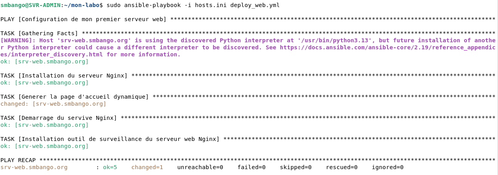
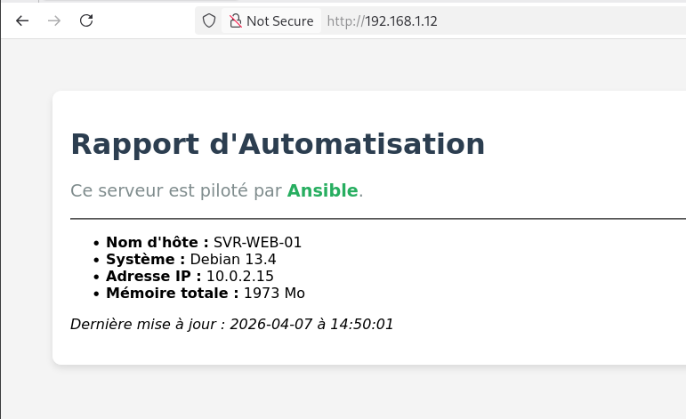

# Lab : Automatisation & Sécurisation d'Infrastructure

Ce dépôt contient les fichiers de configuration Ansible utilisés pour déployer une architecture réseau sécurisée. L'objectif est de masquer un serveur web derrière un Reverse Proxy et de segmenter les flux via un pare-feu.

## 1. Architecture Réseau
L'infrastructure est virtualisée sous VirtualBox et isolée derrière un firewall pfSense.

**Composants du Lab :**
* **pfSense** : Pare-feu et gestion du routage.
* **SVR-ADMIN** : Nœud de contrôle Ansible (Debian).
* **SVR-PROXY** : Reverse Proxy Nginx (Point d'entrée unique).
* **SVR-WEB-01** : Serveur d'application (Isolé du flux direct).

## 2. Automatisation (Ansible)
Le déploiement des serveurs est entièrement automatisé pour garantir une configuration identique et sécurisée.

**Actions réalisées :**
* Installation et configuration de Nginx.
* Déploiement de pages web dynamiques (Templates Jinja2).
* Gestion des services et redémarrages automatiques.

> **[EMPLACEMENT : Insère ici la capture de ton terminal avec le succès du playbook]**

## 3. Sécurité (Reverse Proxy)
Le serveur web (`.11`) est dissimulé. Seul le proxy (`.12`) répond aux requêtes externes.

**Sécurité appliquée :**
* **Masquage d'IP** : L'utilisateur final ne connaît jamais l'IP réelle du serveur web.
* **Headers HTTP** : Protection contre le clickjacking et le XSS via des en-têtes de sécurité.

---

## 4. Structure des fichiers
* `/ansible` : Playbooks YAML et inventaire `hosts.ini`.
* `/ansible/templates` : Fichier `index.html.j2` pour le contenu dynamique.
* `/docs` : Captures d'écran et schémas techniques.
